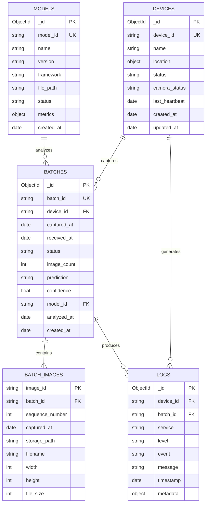

# Fire Detection and Prevention — AI-Based Edge Monitoring System

> **University Diploma Project — MVP Architecture & System Specification**

## 1. Project Overview

This project aims to develop a **distributed AI-assisted fire detection system** that combines edge computing, computer vision, automated processing, and centralized monitoring.

The system consists of one or more **Raspberry Pi edge devices** equipped with cameras. Each edge device periodically captures a short sequence of images and sends them as a batch to a central server. The server asynchronously analyzes the images using an AI model trained to distinguish between **fire** and **non-fire** scenes.

The main goal of the diploma project is not to build a production-grade fire alarm system, but to demonstrate a complete **Minimum Viable Product (MVP)** in which the entire system flow works:

```text
Camera
   │
   ▼
Raspberry Pi
   │
   │ 5 images / 5-second interval
   ▼
Image Batch
   │
   ▼
Main Control Service
   │
   │ asynchronous processing
   ▼
Image Analysis Service
   │
   │ AI prediction
   ▼
Main Control Service
   │
   ├──────────────► Database Service
   │
   └──────────────► Web Dashboard Service
                         │
                         ▼
                     Operator
```

The project also demonstrates an important concept of modern automation: **moving computationally expensive AI processing to a centralized server while keeping image acquisition and basic device responsibilities at the edge.**

---

# 2. Main Objectives

The primary objectives are:

1. Build an edge device capable of periodically capturing images.
2. Group several consecutive images into an image batch.
3. Transfer image batches from the edge device to a central server.
4. Monitor the health/status of each edge device.
5. Validate incoming data before processing.
6. Analyze image batches using an AI-based computer vision model.
7. Determine whether a batch represents a **fire** or **non-fire** situation.
8. Store detection results, device states, logs, and recent images.
9. Provide a web dashboard for an operator.
10. Display edge devices and their states on a map.
11. Demonstrate asynchronous processing so that slow AI inference does not block the rest of the system.
12. Create a modular architecture that can later be extended to multiple cameras and more advanced AI models.

---

# 3. System Architecture

The system is divided into two major parts:

### Edge Layer

Responsible for:

* image acquisition;
* camera health monitoring;
* basic device health information;
* creation of image batches;
* communication with the central server.

### Server Layer

Responsible for:

* receiving and validating data;
* orchestrating the complete workflow;
* AI-based image analysis;
* persistent storage;
* visualization and operator interaction.

A simplified architecture is:

```text
                    ┌─────────────────────┐
                    │     Edge Device     │
                    │    Raspberry Pi 3   │
                    │                     │
                    │  OV5647 Camera      │
                    │       │             │
                    │       ▼             │
                    │  Image Capture      │
                    │       │             │
                    │       ▼             │
                    │  Batch Builder      │
                    └─────────┬───────────┘
                              │
                              │ HTTP/API
                              │
                              ▼
                    ┌─────────────────────┐
                    │ Main Control        │
                    │ Service (MCS)       │
                    │                     │
                    │ Orchestration       │
                    │ Validation          │
                    │ Device management   │
                    │ Job management      │
                    └──────┬───────┬──────┘
                           │       │
                async job  │       │ results/status
                           │       │
                           ▼       ▼
                 ┌────────────┐  ┌────────────┐
                 │    IAS     │  │    WDS     │
                 │ AI / CV    │  │ Dashboard  │
                 └─────┬──────┘  └─────┬──────┘
                       │                │
                       │ prediction     │
                       ▼                │
                    ┌────────────────────┐
                    │        DBS         │
                    │      MongoDB       │
                    └────────────────────┘
```

---

# 4. Edge Device

## 4.1 Hardware

The initial prototype uses:

* **Raspberry Pi 3 Model B v1.2**
* **OV5647 camera module**
* Network connection
* Appropriate power supply

The Raspberry Pi acts as an autonomous monitoring device.

The architecture should not depend on there being only one Raspberry Pi. Every device should have a unique identifier such as:

```text
edge-001
edge-002
edge-003
```

This allows the MVP to evolve from one camera into a distributed network of cameras.

---

# 5. Image Acquisition

The edge device captures **5 images per batch**.

The proposed sequence is:

```text
Image 1
   │
   │ wait 5 seconds
   ▼
Image 2
   │
   │ wait 5 seconds
   ▼
Image 3
   │
   │ wait 5 seconds
   ▼
Image 4
   │
   │ wait 5 seconds
   ▼
Image 5
```

The resulting batch therefore represents approximately **20 seconds of visual information** from the camera.

Example:

```text
Batch ID: 8f5c2...

image_001.jpg  T+00s
image_002.jpg  T+05s
image_003.jpg  T+10s
image_004.jpg  T+15s
image_005.jpg  T+20s
```

The exact timing should be recorded in the metadata rather than assumed by the server.

Each image should contain metadata such as:

```text
device_id
batch_id
image_id
timestamp
image sequence number
camera information
```

---

# 6. Why Use an Image Batch?

A single image can be misleading.

For example, the AI model may encounter:

* sunlight;
* headlights;
* streetlights;
* reflections;
* orange-colored objects;
* smoke-like structures;
* bright windows;
* clouds;
* other objects that visually resemble fire.

Using several images captured over time provides additional information.

A real fire may exhibit **temporal visual changes**, such as:

* changing flame shape;
* movement;
* expansion;
* changing brightness;
* changing smoke patterns.

Therefore, instead of treating every image independently, the system can make a decision about the **whole batch**.

Conceptually:

```text
Image 1 ─┐
Image 2 ─┤
Image 3 ─┼──► Temporal / Batch Analysis ──► FIRE
Image 4 ─┤
Image 5 ─┘
```

This does not guarantee that temporal analysis will improve accuracy, but it provides a strong basis for experimentation in the diploma project.

---

# 7. Main Control Service (MCS)

The **Main Control Service** is the central orchestrator of the system.

Its purpose is to contain the application-level logic rather than performing AI inference itself.

## Responsibilities

MCS should:

* receive image batches;
* receive edge-device health information;
* authenticate/identify devices;
* validate requests;
* validate batch structure;
* assign processing jobs;
* communicate with IAS;
* handle asynchronous analysis;
* receive analysis results;
* store relevant information through DBS;
* notify/update WDS;
* maintain processing states;
* handle errors and timeouts;
* create system logs.

---

# 8. Asynchronous Processing

One of the most important architectural requirements is that **AI analysis must not block the main control flow**.

AI inference may take significantly longer than receiving an image batch.

Therefore, the preferred flow is:

```text
Edge Device
     │
     │ upload batch
     ▼
    MCS
     │
     │ validate
     ▼
 Create Analysis Job
     │
     ├──────────────► Database
     │
     ▼
   Queue / Job
     │
     ▼
    IAS
     │
     │ analysis
     │
     ▼
 Analysis Result
     │
     ▼
    MCS
     │
     ├────────────► Database
     │
     └────────────► Dashboard
```

For the MVP, asynchronous processing can initially be implemented with a simple background job mechanism.

A message broker such as **RabbitMQ** or **Redis** can be introduced later if required.

This separation is important because it prevents the architecture from becoming:

```text
Receive image
    ↓
Wait for AI
    ↓
AI finishes
    ↓
Return response
    ↓
Receive next image
```

Instead, it becomes:

```text
Receive
  ↓
Validate
  ↓
Queue
  ↓
Continue
```

This makes the system more scalable.

---

# 9. Suggested Processing States

Each image batch should have a lifecycle.

For example:

```text
RECEIVED
   │
   ▼
VALIDATED
   │
   ▼
QUEUED
   │
   ▼
PROCESSING
   │
   ├──────────────► FAILED
   │
   ▼
COMPLETED
```

The database should retain this state.

Example:

```json
{
  "batch_id": "batch-001",
  "device_id": "edge-001",
  "status": "PROCESSING"
}
```

After analysis:

```json
{
  "batch_id": "batch-001",
  "device_id": "edge-001",
  "status": "COMPLETED",
  "prediction": "FIRE",
  "confidence": 0.94
}
```

---

# 10. Image Analysis Service (IAS)

The **Image Analysis Service** is responsible for AI-based fire detection.

IAS should be isolated from the rest of the application so that the AI model can be changed without redesigning the entire system.

## Responsibilities

IAS should:

1. Receive an analysis job.
2. Load the corresponding images.
3. Preprocess the images.
4. Load the trained model.
5. Run inference.
6. Combine the predictions.
7. Return the batch-level result.
8. Return a confidence/probability score.
9. Record model/version information.

---

# 11. Training Dataset

The initial dataset structure is:

```text
data/
├── fire/
└── non-fire/
    ├── daytime/
    ├── house_data/
    ├── nighttime/
    ├── non_fire_images/
    ├── streetlight/
    ├── street_data/
    └── sunrise/
```

The important distinction is:

```text
fire
non-fire
```

The subcategories inside `non-fire` are particularly useful because they represent different situations that could potentially produce false positives.

Examples include:

* daytime scenes;
* nighttime scenes;
* streetlights;
* houses;
* streets;
* sunrise;
* other non-fire environments.

This allows the model to learn that **bright light does not necessarily mean fire**.

---

# 12. AI Model

The first MVP should favor a relatively simple and well-understood model rather than an overly complex architecture.

A possible approach is:

```text
Input Image
     │
     ▼
Image Preprocessing
     │
     ▼
CNN / Transfer Learning Model
     │
     ▼
Fire Probability
```

For example, a pretrained image classification network can be fine-tuned on the project's dataset.

Potential models for experimentation include lightweight architectures such as:

* MobileNet;
* EfficientNet;
* ResNet;
* other pretrained CNN architectures.

The final model should be selected based on experimental results rather than simply choosing the most complex architecture.

The trained model should be exported and stored separately from the training code.

For example:

```text
ias/
├── app/
├── models/
│   └── fire_detection_model...
├── data/
│   ├── fire/
│   └── non-fire/
└── tests/
```

---

# 13. Batch-Level Prediction

There are several possible approaches to converting five image predictions into one batch prediction.

### MVP approach — majority voting

Each image is independently classified:

```text
Image 1 → FIRE
Image 2 → FIRE
Image 3 → FIRE
Image 4 → NON-FIRE
Image 5 → FIRE
```

The batch result becomes:

```text
FIRE
```

because 4/5 images were classified as fire.

Another approach is averaging probabilities:

```text
Image 1 → 0.91
Image 2 → 0.87
Image 3 → 0.93
Image 4 → 0.31
Image 5 → 0.89

Average = 0.782
```

Then:

```text
Average probability > threshold
              ↓
            FIRE
```

This is likely a good starting point for the MVP because it is simple to implement and easy to explain experimentally.

---

# 14. Future Temporal AI Model

The five images also create an opportunity for a more advanced model.

Instead of:

```text
Image → CNN → Prediction
```

a future version could use:

```text
Image 1 ─┐
Image 2 ─┤
Image 3 ─┼──► CNN feature extraction
Image 4 ─┤
Image 5 ─┘
             │
             ▼
       Temporal Model
             │
             ▼
       Batch Prediction
```

Possible approaches include:

* CNN + LSTM;
* CNN + GRU;
* 3D CNN;
* video classification models;
* transformer-based temporal models.

This is not required for the initial MVP but provides a clear direction for further research.

---

# 15. Web Dashboard Service (WDS)

The **Web Dashboard Service** provides the human-readable interface for the operator.

The dashboard should provide a centralized view of the monitoring system.

## MVP Dashboard

The dashboard should display:

### Map

A map containing the location of each edge device.

Example:

```text
              MAP

       ● edge-001
                \
                 \
                  ● edge-002

          ● edge-003
```

Each marker should visually communicate the current state.

Possible states:

```text
ONLINE
OFFLINE
WARNING
FIRE DETECTED
PROCESSING
```

### Device Information

Selecting a device should display:

* device ID;
* location;
* connection status;
* last heartbeat;
* camera status;
* last image;
* latest detection;
* latest confidence;
* last successful batch;
* error information.

### Latest Logs

The operator should be able to see recent events such as:

```text
15:20:31 edge-001 batch received
15:20:32 batch queued
15:20:40 AI analysis started
15:20:43 FIRE detected
15:20:43 dashboard updated
```

---

# 16. Database Service (DBS)

The **Database Service** encapsulates communication with MongoDB.

The rest of the system should preferably communicate with DBS through an API instead of directly accessing MongoDB.

This provides separation between:

```text
Application Services
       │
       ▼
Database Service
       │
       ▼
    MongoDB
```

DBS is responsible for storing:

* edge devices;
* device health;
* image batches;
* image metadata;
* image references;
* analysis results;
* processing states;
* logs;
* model information.

---

# 17. Storage of Images

The project requires the latest three batches to be retained.

However, storing large binary images directly inside MongoDB is not necessarily the best approach.

A cleaner architecture is:

```text
MongoDB
   │
   └── metadata + file references

File/Object Storage
   │
   └── actual image files
```

For the MVP, images can simply be stored in a mounted server directory:

```text
storage/
├── edge-001/
│   ├── batch-001/
│   │   ├── image-001.jpg
│   │   ├── image-002.jpg
│   │   ├── image-003.jpg
│   │   ├── image-004.jpg
│   │   └── image-005.jpg
│   └── batch-002/
└── edge-002/
```

MongoDB then stores the path/reference.

This keeps the database focused on structured data.

If the project later requires database-native image storage, **GridFS** can be considered.

---

# 18. Retention Policy

Only the **three latest completed batches per device** need to be retained for the MVP.

For example:

```text
edge-001

Batch 103  ← newest
Batch 102
Batch 101
Batch 100  ← delete
```

When a new batch is completed:

```text
New Batch 104
      ↓
Keep:
104
103
102

Delete:
101
```

The cleanup operation can be performed by MCS or DBS.

A better long-term architecture would allow retention to be configurable.

---

# 19. Device Health Monitoring

Every edge device should periodically send a heartbeat.

Example:

```json
{
  "device_id": "edge-001",
  "timestamp": "2026-08-16T15:00:00Z",
  "camera_status": "OK",
  "storage_status": "OK",
  "network_status": "OK",
  "temperature": 48.2
}
```

The exact health information depends on what is practical to obtain from the Raspberry Pi.

MCS can determine device status based on the latest heartbeat.

For example:

```text
Heartbeat received recently
        ↓
      ONLINE

No heartbeat for configured period
        ↓
      OFFLINE
```

---

# 20. Communication Between Services

A possible MVP communication model is:

```text
Edge → MCS
MCS → IAS
MCS → DBS
MCS → WDS
IAS → MCS
WDS → MCS
```

Possible protocols:

| Communication               | Suggested technology           |
| --------------------------- | ------------------------------ |
| Edge → MCS                  | HTTP REST                      |
| WDS → MCS                   | HTTP REST                      |
| MCS → DBS                   | HTTP REST                      |
| MCS → IAS                   | HTTP REST / background job     |
| Browser → WDS               | HTTP                           |
| Real-time dashboard updates | WebSocket / Server-Sent Events |

For the MVP, REST APIs are sufficient.

A message broker can be introduced if asynchronous processing becomes more complex.

---

# 21. Docker Architecture

All server-side services should run as Docker containers.

Example:

```text
docker-compose.yml

services:

  mcs:
    Main Control Service

  ias:
    Image Analysis Service

  wds:
    Web Dashboard Service

  dbs:
    Database Service

  mongodb:
    MongoDB database
```

The resulting architecture is:

```text
┌───────────────────────────────────────────────┐
│                 Docker Host                   │
│                                               │
│  ┌───────┐   ┌───────┐   ┌───────┐            │
│  │  MCS  │   │  IAS  │   │  WDS  │            │
│  └───┬───┘   └───┬───┘   └───┬───┘            │
│      │           │           │                │
│      └───────────┼───────────┘                │
│                  │                            │
│              ┌───▼───┐                       │
│              │  DBS  │                       │
│              └───┬───┘                       │
│                  │                            │
│              ┌───▼──────┐                    │
│              │ MongoDB  │                    │
│              └──────────┘                    │
│                                               │
└───────────────────────────────────────────────┘
```

---

# 22. Recommended Repository Structure

A possible GitHub repository structure is:

```text
fire-detection-system/
│
├── edge/
│   ├── app/
│   ├── camera/
│   ├── batch/
│   ├── health/
│   ├── config/
│   └── tests/
│
├── services/
│   ├── mcs/
│   │   ├── app/
│   │   ├── tests/
│   │   └── Dockerfile
│   │
│   ├── ias/
│   │   ├── app/
│   │   ├── models/
│   │   ├── training/
│   │   ├── data/
│   │   ├── tests/
│   │   └── Dockerfile
│   │
│   ├── wds/
│   │   ├── app/
│   │   ├── tests/
│   │   └── Dockerfile
│   │
│   └── dbs/
│       ├── app/
│       ├── tests/
│       └── Dockerfile
│
├── storage/
│
├── docs/
│   ├── architecture/
│   ├── api/
│   └── database/
│
├── docker-compose.yml
├── .env.example
├── .gitignore
└── README.md
```

The actual technologies can be changed without changing the architectural responsibilities.

---

# 23. Example End-to-End Flow

Consider an edge device named `edge-001`.

### Step 1 — Capture

The Raspberry Pi captures five images:

```text
batch-123
 ├── image-1
 ├── image-2
 ├── image-3
 ├── image-4
 └── image-5
```

### Step 2 — Upload

The edge device sends the batch to MCS.

### Step 3 — Validation

MCS verifies:

* device exists;
* request is valid;
* batch ID is valid;
* five images are present;
* image metadata is valid;
* files are within allowed limits.

### Step 4 — Store

MCS/DBS stores the batch metadata and image references.

### Step 5 — Queue

MCS creates an analysis job:

```text
batch-123 → QUEUED
```

### Step 6 — AI Analysis

IAS receives the job:

```text
batch-123
    ↓
5 images
    ↓
preprocessing
    ↓
AI model
    ↓
5 predictions
```

### Step 7 — Batch Decision

Example:

```text
Image 1: 0.92 FIRE
Image 2: 0.89 FIRE
Image 3: 0.87 FIRE
Image 4: 0.78 FIRE
Image 5: 0.35 NON-FIRE
```

Final result:

```text
FIRE
confidence: 0.87
```

### Step 8 — Store Result

DBS stores the result.

### Step 9 — Dashboard

WDS displays:

```text
edge-001
────────────────────────
Status: ONLINE
Camera: OK

Latest detection:
🔥 FIRE

Confidence:
87%

Batch:
batch-123

Time:
15:20:43

[Latest Image]
```

The map marker for `edge-001` can also change to a fire/warning state.

---

# 24. Error Handling

The MVP should account for common failures.

## Edge Device Offline

```text
No heartbeat
     ↓
MCS detects timeout
     ↓
Device marked OFFLINE
     ↓
Dashboard updated
```

## Invalid Batch

```text
Invalid request
     ↓
MCS rejects batch
     ↓
Log error
     ↓
Notify edge device
```

## IAS Failure

```text
MCS → IAS
       ↓
    failure
       ↓
batch = FAILED
       ↓
log error
       ↓
dashboard updated
```

## Database Failure

The services should return appropriate errors rather than silently losing information.

For a more advanced implementation, jobs can be retried.

---

# 25. Security Considerations

Security does not need to become the primary focus of the MVP, but the architecture should include basic protection.

At minimum:

* unique device identifiers;
* API authentication between edge and MCS;
* request validation;
* maximum image size;
* maximum batch size;
* input validation;
* environment variables for secrets;
* no credentials committed to Git;
* restricted MongoDB access;
* HTTPS in a production deployment.

The project should explicitly distinguish between a **university prototype** and a real-world fire safety system.

---

# 26. Important Limitation

This project should **not be presented as a certified fire alarm or life-safety system**.

A computer-vision model can produce:

* false positives;
* false negatives;
* incorrect predictions under unusual lighting;
* incorrect predictions when the camera is obstructed;
* errors caused by smoke, reflections, weather, or environmental changes.

The MVP is therefore intended to demonstrate:

> **AI-assisted visual fire detection and automated monitoring**, not a replacement for certified fire detection equipment.

This distinction is particularly important when describing the project academically.

---

# 27. MVP Definition

The project can be considered complete at MVP level when the following flow works reliably:

```text
Raspberry Pi
     │
     │ capture 5 images
     ▼
Create Batch
     │
     ▼
MCS
     │
     ├── validate
     ├── store
     └── queue
            │
            ▼
           IAS
            │
            ├── load model
            ├── analyze 5 images
            └── produce batch result
                     │
                     ▼
                    MCS
                     │
              ┌──────┴──────┐
              ▼             ▼
             DBS           WDS
              │             │
              │             ▼
              │          Operator
              │
              ▼
        Persistent data
```

### MVP checklist

* [x] Raspberry Pi captures images.
* [x] Five images are grouped into a batch.
* [ ] Five images are captured approximately 5 seconds apart.
* [ ] Edge device sends batches to MCS.
* [ ] Edge device sends health information.
* [ ] MCS validates incoming data.
* [ ] MCS handles asynchronous analysis.
* [ ] IAS loads a trained fire-detection model.
* [ ] IAS analyzes the five images.
* [ ] IAS produces a batch-level result.
* [ ] MCS stores the result.
* [ ] DBS stores device state and logs.
* [ ] DBS retains the three latest batches.
* [ ] WDS displays devices on a map.
* [ ] WDS displays device health.
* [ ] WDS displays the latest detection.
* [ ] WDS displays the latest image.
* [ ] WDS displays recent logs.
* [ ] All server services run using Docker.

---

# 28. Future Improvements

After the MVP is functional, the following improvements could be investigated:

### AI

* temporal models;
* smoke detection;
* fire localization using object detection;
* segmentation of the fire region;
* model quantization;
* confidence calibration;
* improved dataset balancing;
* automated data augmentation.

### Edge Computing

* preliminary AI inference directly on Raspberry Pi;
* local fire detection when the server is unavailable;
* local image compression;
* adaptive image capture frequency.

### Infrastructure

* message broker;
* multiple MCS instances;
* multiple IAS workers;
* GPU inference;
* Kubernetes deployment;
* object storage.

### Dashboard

* live WebSocket updates;
* historical detection graphs;
* device configuration;
* alarm acknowledgment;
* image/video playback;
* historical map data.

### Reliability

* automatic retry;
* job queues;
* health checks;
* service metrics;
* centralized logging;
* automatic database backup.

---

# 29. MongoDB Database Design

The database is designed around the following main entities:

```text
Device
   │
   ├──────────► Heartbeat / Health
   │
   ├──────────► Batch
   │                │
   │                ├──► Images
   │                │
   │                └──► Analysis Result
   │
   └──────────► Logs

Model
```

A practical MongoDB design can use the following collections:

```text
devices
batches
logs
models
```

Image metadata can be embedded inside the corresponding `batches` document while the actual image files remain in filesystem/object storage.

---

# 30. MongoDB ER Diagram



---

# 31. MongoDB Collection Structure

## `devices`

Example document:

```json
{
  "_id": "ObjectId(...)",
  "device_id": "edge-001",
  "name": "Entrance Camera",
  "location": {
    "latitude": 42.441,
    "longitude": 19.263
  },
  "status": "ONLINE",
  "camera_status": "OK",
  "last_heartbeat": "2026-08-16T15:00:00Z",
  "created_at": "2026-08-01T10:00:00Z",
  "updated_at": "2026-08-16T15:00:00Z"
}
```

---

## `batches`

Example document:

```json
{
  "_id": "ObjectId(...)",
  "batch_id": "batch-123",
  "device_id": "edge-001",
  "captured_at": "2026-08-16T15:00:00Z",
  "received_at": "2026-08-16T15:00:22Z",

  "status": "COMPLETED",

  "image_count": 5,

  "images": [
    {
      "image_id": "img-001",
      "sequence_number": 1,
      "captured_at": "2026-08-16T15:00:00Z",
      "storage_path": "edge-001/batch-123/image-001.jpg",
      "filename": "image-001.jpg"
    },
    {
      "image_id": "img-002",
      "sequence_number": 2,
      "captured_at": "2026-08-16T15:00:05Z",
      "storage_path": "edge-001/batch-123/image-002.jpg",
      "filename": "image-002.jpg"
    }
  ],

  "analysis": {
    "prediction": "FIRE",
    "confidence": 0.87,
    "model_id": "fire-model",
    "model_version": "1.0.0",
    "analyzed_at": "2026-08-16T15:00:43Z"
  },

  "created_at": "2026-08-16T15:00:22Z"
}
```

For readability, only two images are shown in the example; the actual batch contains all five.

---

# 32. `logs`

Example document:

```json
{
  "_id": "ObjectId(...)",
  "device_id": "edge-001",
  "batch_id": "batch-123",
  "service": "MCS",
  "level": "INFO",
  "event": "BATCH_RECEIVED",
  "message": "Image batch received successfully",
  "timestamp": "2026-08-16T15:00:22Z",
  "metadata": {
    "image_count": 5
  }
}
```

Possible log levels:

```text
DEBUG
INFO
WARNING
ERROR
CRITICAL
```

---

# 33. `models`

Example document:

```json
{
  "_id": "ObjectId(...)",
  "model_id": "fire-model",
  "name": "Fire Detection CNN",
  "version": "1.0.0",
  "framework": "TensorFlow",
  "file_path": "models/fire_detection_model",
  "status": "ACTIVE",

  "metrics": {
    "accuracy": 0.94,
    "precision": 0.92,
    "recall": 0.91,
    "f1_score": 0.915
  },

  "created_at": "2026-08-10T12:00:00Z"
}
```

Keeping the model version in the database is important because predictions should be traceable to the exact model that produced them.

---

# 34. Batch Retention Strategy

The database should maintain only the three newest batches per device for the MVP.

```text
                    DEVICE
                      │
        ┌─────────────┼─────────────┐
        ▼             ▼             ▼
     Batch N       Batch N-1      Batch N-2
     KEEP          KEEP           KEEP
                                     
     Batch N-3
     DELETE
```

This can be implemented using:

1. query batches ordered by `captured_at`;
2. keep the newest three;
3. delete older batch metadata;
4. delete corresponding image files.

The cleanup operation should be atomic from the application's perspective as much as practical, so that the database does not retain references to deleted files.

---

# 35. Recommended MongoDB Indexes

The MVP should create indexes for commonly queried fields.

### Devices

```text
device_id
status
last_heartbeat
```

### Batches

```text
batch_id
device_id + captured_at
device_id + status
```

### Logs

```text
device_id + timestamp
batch_id + timestamp
service + timestamp
level + timestamp
```

### Models

```text
model_id
status
```

The most important index for the dashboard and retention logic is:

```text
batches: { device_id: 1, captured_at: -1 }
```

This makes retrieving the latest batches for a device efficient.

---

# 36. Final Architecture Summary

The proposed system follows a clear separation of responsibilities:

| Component           | Responsibility                          |
| ------------------- | --------------------------------------- |
| Raspberry Pi        | Image acquisition and edge health       |
| MCS                 | System orchestration and business logic |
| IAS                 | AI image analysis                       |
| WDS                 | Operator interface                      |
| DBS                 | Database abstraction and persistence    |
| MongoDB             | Persistent structured data              |
| File/Object Storage | Actual image files                      |

The most important architectural principle is:

> **The edge device captures and transmits data, MCS orchestrates the workflow, IAS performs computationally expensive AI inference, DBS persists system state, and WDS provides the operator with a real-time view of the system.**

The initial MVP should intentionally remain simple. The primary objective is to demonstrate a reliable end-to-end pipeline:

```text
CAPTURE
   ↓
BATCH
   ↓
UPLOAD
   ↓
VALIDATE
   ↓
QUEUE
   ↓
AI ANALYSIS
   ↓
BATCH DECISION
   ↓
STORE
   ↓
DISPLAY
```

Once this pipeline works reliably, more sophisticated temporal AI, distributed processing, real-time communication, and edge inference can be added incrementally.

---

## 37. Suggested Diploma Contribution

The strongest academic aspect of the project is not simply "training a fire classifier." The project combines several areas:

```text
                 FIRE DETECTION SYSTEM
                         │
       ┌─────────────────┼─────────────────┐
       │                 │                 │
       ▼                 ▼                 ▼
 Edge Computing      Artificial        Distributed
                     Intelligence       Systems
       │                 │                 │
       │                 │                 │
 Raspberry Pi       Computer Vision     Microservices
 Camera             CNN / ML            Docker
 Image Capture      Classification      Async Processing
 Health Monitoring  Temporal Analysis   REST APIs
       │                 │                 │
       └─────────────────┼─────────────────┘
                         │
                         ▼
                  Automated Monitoring
                         │
                         ▼
                    Web Dashboard
```

This makes the project suitable for demonstrating both **software engineering and applied AI**, while leaving enough room for experimental evaluation of the fire-detection model.
